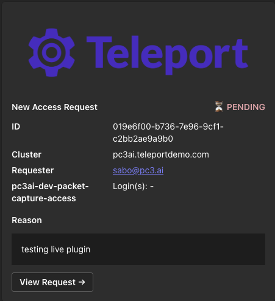
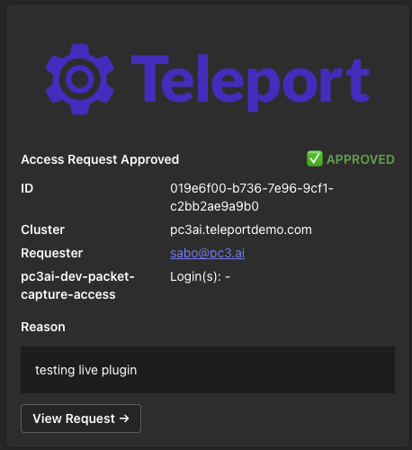
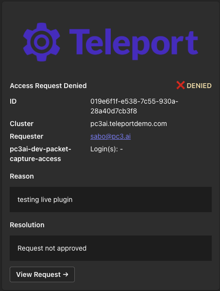

# teleport-msteams-webhook

Posts Microsoft Teams Adaptive Card notifications when Teleport access requests are created, approved, or denied.

Uses Teams **incoming webhooks** — a URL a channel owner creates in ~2 clicks via the Power Automate Workflows app. No Azure AD registration, no Global Admin approval, no custom app package.

<table>
<tr>
<td align="center"><br/><b>Pending</b></td>
<td align="center"><br/><b>Approved</b></td>
<td align="center"><br/><b>Denied</b></td>
</tr>
</table>

## How it differs from the official `msteams` plugin

| | teleport-msteams-webhook | Official msteams plugin |
|---|---|---|
| Teams setup | 2 clicks per channel | Azure AD app registration + Global Admin + Teams Administrator approval + custom app package |
| Approve/deny in Teams | No — link to Teleport UI | Yes (interactive buttons) |
| Credentials | tbot machine identity (auto-refresh) | Azure AD service principal |
| Routing | `role_to_recipients` TOML map | Same |

If you need interactive approve/deny buttons in Teams, use the official plugin. If you want simple notifications with minimal setup, this tool is for you.

---

## Teams setup

**Create an incoming webhook for each Teams channel you want to notify:**

1. In the channel, click **`···`** (More options) next to the channel name and select **Workflows**. If you don't see it, click the **+** icon in the channel toolbar and search for **Workflows**.
2. Search for **"Post to a channel when a webhook request is received"** and select it.
3. Teams pre-fills a name like **"Send webhook alerts to [channel-name]"** — keep it or rename it, then click **Next** → **Add workflow**.
4. When setup completes the workflow shows as **Active**. Click **Copy webhook link** to grab the URL.

The URL format varies by Teams plan:
- Enterprise Microsoft 365: `https://prod2.westus2.logic.azure.com/workflows/...`
- Personal / free Teams: `https://default[...].environment.api.powerplatform.com/...`

Both formats work identically with this plugin. Treat the URL as a secret — anyone with it can post to the channel.

Repeat for each channel. Paste the URLs into `role_to_recipients` in your config.

> **Note:** Microsoft deprecated Office 365 Connectors in 2024. The Power Automate Workflows method above is the current replacement.

### Storing webhook URLs securely

Instead of hardcoding webhook URLs in the config file, you can reference environment variables or secret-mount files:

```toml
[role_to_recipients]
# Read from an environment variable
"dev" = ["env:TEAMS_WEBHOOK_DEV"]

# Read from a file (Vault agent, Kubernetes Secret mount, AWS Secrets Manager sidecar, etc.)
"*"   = ["file:/run/secrets/teams-webhook-general"]

# Plain URL still works
"ops" = ["https://prod.westus2.logic.azure.com/.../ops"]
```

The value in the env var or file must be the full `https://` webhook URL. All URLs (plain or resolved) are validated to use HTTPS at startup — the plugin will not start if a URL is invalid or a referenced variable/file is missing.

---

## Teleport setup

### Create the bot role and bot

Save this as `msteams-webhook-role-and-bot.yaml` and apply with `tctl create -f msteams-webhook-role-and-bot.yaml`:

```yaml
kind: role
version: v7
metadata:
  name: msteams-webhook
spec:
  allow:
    rules:
      - resources: [access_request]
        verbs: [list, read]
      - resources: [role]
        verbs: [list, read]
---
kind: bot
version: v1
metadata:
  name: msteams-webhook
spec:
  roles: [msteams-webhook]
```

The `role` permission is optional — it enables the plugin to show allowed SSH logins alongside each role in the notification card. Without it, cards still post but the Login(s) field is omitted.

See [Machine & Workload Identity — Getting Started](https://goteleport.com/docs/machine-workload-identity/getting-started/) for full bot creation documentation.

---

## Kubernetes / Helm install

The Helm chart deploys two containers in one pod sharing an `emptyDir` identity volume:
- **tbot** (init container + sidecar) — joins the cluster and keeps the identity file refreshed
- **teleport-msteams-webhook** — reads the identity file and watches for access request events

Ready-to-use example files are in [`examples/kubernetes/`](examples/kubernetes/).

### Step 1 — Apply Teleport resources

```bash
tctl create -f examples/kubernetes/bot-and-role.yaml
tctl create -f examples/kubernetes/token.yaml
```

See [Kubernetes join method](https://goteleport.com/docs/machine-workload-identity/deployment/kubernetes/) and [join methods overview](https://goteleport.com/docs/reference/deployment/join-methods/).

### Step 2 — Create the namespace and webhook Secret

Fill in your Teams webhook URL in `examples/kubernetes/webhook-secret.yaml`, then:

```bash
kubectl create namespace teleport-plugins
kubectl apply -f examples/kubernetes/webhook-secret.yaml
```

### Step 3 — Install the Helm chart

Edit `examples/kubernetes/values.yaml` — replace `teleport.example.com` with your proxy address and set `tbot.image.tag` to match your Teleport version, then:

```bash
helm install teleport-msteams-webhook \
  oci://ghcr.io/jsabo/charts/teleport-msteams-webhook \
  --namespace teleport-plugins \
  -f examples/kubernetes/values.yaml
```

### Step 4 — What the chart creates

| Resource | Purpose |
|---|---|
| Deployment | tbot init container + sidecar + plugin container |
| ConfigMap | Rendered `tbot.yaml` and `plugin.toml` |
| ServiceAccount | Used by tbot for the Kubernetes TokenReview join |

### Step 5 — Upgrade / uninstall

```bash
# Upgrade
helm upgrade teleport-msteams-webhook oci://ghcr.io/jsabo/charts/teleport-msteams-webhook \
  --namespace teleport-plugins -f examples/kubernetes/values.yaml

# Uninstall
helm uninstall teleport-msteams-webhook --namespace teleport-plugins
```

---

## Linux / systemd install

### Step 1 — Install the plugin binary

Download the latest release tarball for your platform from the [releases page](https://github.com/jsabo/teleport-msteams-webhook/releases), extract, and install:

```bash
tar -xzf teleport-msteams-webhook_<version>_linux_amd64.tar.gz
sudo install -m 755 teleport-msteams-webhook /usr/local/bin/
```

Or build from source:

```bash
go install github.com/jsabo/teleport-msteams-webhook/cmd/teleport-msteams-webhook@latest
sudo mv $(go env GOPATH)/bin/teleport-msteams-webhook /usr/local/bin/
```

### Step 2 — Install tbot

tbot is Teleport's machine identity agent. It joins the cluster, then continuously writes and refreshes a short-lived certificate bundle to disk. The plugin reads that bundle and reloads it automatically — no static credentials, no restarts when certs rotate.

Install tbot from the [Teleport Linux deployment guide](https://goteleport.com/docs/machine-workload-identity/deployment/linux/):

```bash
# Debian / Ubuntu
curl https://apt.releases.teleport.dev/gpg -o /usr/share/keyrings/teleport-archive-keyring.asc
echo "deb [signed-by=/usr/share/keyrings/teleport-archive-keyring.asc] https://apt.releases.teleport.dev/ubuntu $(lsb_release -cs) stable" \
  | sudo tee /etc/apt/sources.list.d/teleport.list
sudo apt update && sudo apt install teleport
```

### Step 3 — Create a join token for tbot

On your Teleport cluster (via `tctl` or the Teleport UI):

```bash
tctl tokens add --type=bot --bot-name=msteams-webhook --ttl=1h
```

This token is used only once for the initial join. tbot renews its own certificates continuously after that.

For production, consider a [platform join method](https://goteleport.com/docs/reference/deployment/join-methods/) (IAM on AWS, GCP, Azure) that requires no token at all.

### Step 4 — Configure tbot (`/etc/tbot.yaml`)

```yaml
version: v2
proxy_server: teleport.example.com:443

onboarding:
  join_method: token
  token: <paste-token-here>

storage:
  type: directory
  path: /var/lib/tbot

outputs:
  - type: identity
    destination:
      type: directory
      path: /var/lib/teleport/plugins/msteams-webhook
```

See [tbot configuration reference](https://goteleport.com/docs/machine-workload-identity/getting-started/) for all options.

### Step 5 — Create system user and directories

```bash
sudo useradd -r -s /sbin/nologin teleport-plugin
sudo install -d -o teleport-plugin -g teleport-plugin /var/lib/teleport/plugins/msteams-webhook
sudo install -d -o teleport-plugin -g teleport-plugin /var/lib/tbot
```

### Step 6 — systemd unit for tbot

Create `/etc/systemd/system/tbot.service`:

```ini
[Unit]
Description=Teleport Machine Identity Agent (tbot)
After=network-online.target
Wants=network-online.target

[Service]
Type=simple
User=teleport-plugin
Group=teleport-plugin
ExecStart=/usr/local/bin/tbot start -c /etc/tbot.yaml
Restart=on-failure
RestartSec=5s
StandardOutput=journal
StandardError=journal

[Install]
WantedBy=multi-user.target
```

See the [tbot Linux deployment guide](https://goteleport.com/docs/machine-workload-identity/deployment/linux/) for hardening options and distro-packaged unit files.

### Step 7 — Configure the plugin (`/etc/teleport-msteams-webhook.toml`)

```toml
[teleport]
addr             = "teleport.example.com:443"
identity         = "/var/lib/teleport/plugins/msteams-webhook/identity"
refresh_identity = true   # reload cert automatically when tbot renews it

[log]
output   = "stderr"
severity = "info"

[msteams]
# Optional. Defaults to the Teleport logo in this repo.
# Set disable_logo = true to omit the image entirely.
# logo_url    = "https://raw.githubusercontent.com/jsabo/teleport-msteams-webhook/main/assets/teleport-logo.png"
# disable_logo = false

[role_to_recipients]
"dev"            = ["https://prod.westus2.logic.azure.com/.../dev-requests"]
"database-admin" = ["https://prod.westus2.logic.azure.com/.../dba-team",
                    "https://prod.westus2.logic.azure.com/.../security"]
"*"              = ["https://prod.westus2.logic.azure.com/.../access-requests-general"]
```

The `"*"` wildcard catches any role not explicitly listed. It is required.

A copy of this example lives at `deploy/systemd/teleport-msteams-webhook.toml.example`.

### Step 8 — systemd unit for the plugin

Install the unit file from this repo:

```bash
sudo cp deploy/systemd/teleport-msteams-webhook.service /etc/systemd/system/
sudo systemctl daemon-reload
sudo systemctl enable --now tbot teleport-msteams-webhook
```

Follow logs:

```bash
journalctl -u teleport-msteams-webhook -f
```

---

## Verification

### Dry run

Validates credentials and POSTs a test card to every configured webhook URL, then exits:

```bash
teleport-msteams-webhook -config /etc/teleport-msteams-webhook.toml -dry-run
```

A sample Adaptive Card should appear in each configured Teams channel.

### Live test

Create a test access request with `tsh`:

```bash
tsh request create --roles=dev --reason="testing msteams webhook"
```

A card should appear in the channel mapped to the `dev` role (or the `*` wildcard channel).

---

## Troubleshooting

**Card not appearing — check the webhook URL**

Test the webhook URL directly:

```bash
curl -s -o /dev/null -w "%{http_code}" \
  -H "Content-Type: application/json" \
  -d '{"type":"message","attachments":[{"contentType":"application/vnd.microsoft.card.adaptive","content":{"type":"AdaptiveCard","version":"1.4","body":[{"type":"TextBlock","text":"test"}]}}]}' \
  "https://prod.westus2.logic.azure.com/..."
```

A `202` response means the webhook accepted the card. A `4xx` means the URL is wrong or expired — create a new webhook URL in Teams.

**Plugin starts but `no recipients found` in logs**

Ensure your `role_to_recipients` has a `"*"` wildcard entry. The plugin logs the resolved roles and webhook URLs at `debug` severity (`severity = "debug"` in config).

**`identity file not found` on startup**

tbot may not have completed its first certificate write yet. The plugin retries the Teleport connection with exponential backoff, so it will recover once tbot finishes. In Kubernetes, the init container ensures tbot writes the identity before the plugin starts.

Check tbot status:

```bash
# systemd
journalctl -u tbot -f

# Kubernetes
kubectl logs -n teleport-plugins deployment/teleport-msteams-webhook -c tbot
```

**`certificate has expired` errors**

The identity file is stale. Verify tbot is running and `refresh_identity = true` is set in the plugin config. If tbot was down for longer than the cert TTL (default: 1 hour), restart tbot — it will re-join and write a fresh identity.

**`permission denied` reading access requests**

The bot role is missing the `access_request` list/read rule. Verify with:

```bash
tctl get role/msteams-webhook
```

Re-apply the role YAML from the [Teleport setup](#teleport-setup) section if needed.

---

## Logo customization

The default card includes the Teleport logo fetched from this repo's `assets/` directory. Teams caches card images aggressively on the client side — this is not a per-notification request.

To use your own logo:

```toml
[msteams]
logo_url = "https://example.com/your-logo.png"
```

To disable the logo entirely:

```toml
[msteams]
disable_logo = true
```

Cards work correctly either way — the logo is purely cosmetic.

---

## Building from source

```bash
git clone https://github.com/jsabo/teleport-msteams-webhook.git
cd teleport-msteams-webhook
make build   # produces ./teleport-msteams-webhook
make test    # run all unit tests
make vet     # go vet
```

## License

[Apache 2.0](LICENSE)
